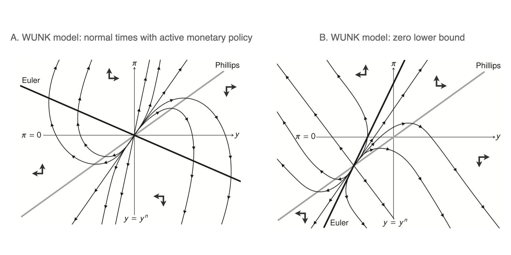

---

##### Download

+ [Paper](MSA+2022.pdf)

---

##### Abstract

Needed improvements to mobile broadband deployment require more accurate mapping of mobile coverage, especially in rural and tribal areas.

---

##### Figure 2: Map of authorwardriving areas in New Mexico.



---

##### Citation

Tarun Mangla, Esther Showalter, Vivek Adarsh, Kipp Jones, Morgan Vigil-Hayes, Elizabeth Belding, and Ellen Zegura. 2022. A tale of three datasets: characterizing mobile broadband access in the U.S. Commun. ACM 65, 3 (March 2022), 67–74. https://doi.org/10.1145/3462672

```BibTeX
@article{10.1145/3462672,
author = {Mangla, Tarun and Showalter, Esther and Adarsh, Vivek and Jones, Kipp and Vigil-Hayes, Morgan and Belding, Elizabeth and Zegura, Ellen},
title = {A Tale of Three Datasets: Characterizing Mobile Broadband Access in the U.S.},
year = {2022},
issue_date = {March 2022},
publisher = {Association for Computing Machinery},
address = {New York, NY, USA},
volume = {65},
number = {3},
issn = {0001-0782},
url = {https://doi.org/10.1145/3462672},
doi = {10.1145/3462672},
abstract = {Needed improvements to mobile broadband deployment require more accurate mapping of mobile coverage, especially in rural and tribal areas.},
journal = {Commun. ACM},
month = {feb},
pages = {67–74},
numpages = {8}
}

```

