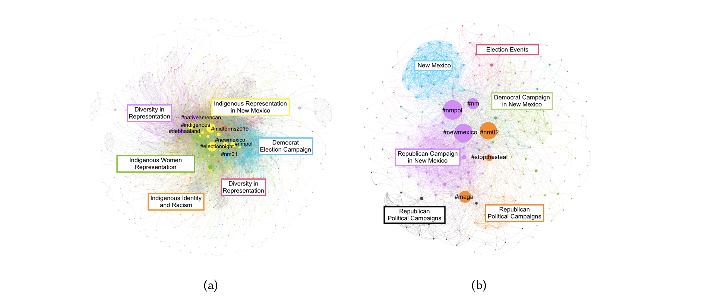

---

##### Download

+ [Paper](VPD2019.pdf)

---

##### Abstract

In the 2018 U.S. midterm elections, a record number of Native American candidates ran for office at all levels of government. To better understand how these 104 candidates intersected with Indigenous political issues and movements to increase Native American voter turnout, we study 723,269 tweets about or by these candidates and 15,476 tweets associated with the #NativeVote movement between October 6, 2018 and February 5, 2019. We use a mixed methods approach to identify issues that emerge in the Native Candidates data set, including issues of representation and protean usage of the "Make America Great Again" hashtag #maga. When examining the feeds of selected candidates, we find that there can be a disconnect between the issues that candidates align themselves with on social media and the issues that they are associated with by others. We also find evidence of Indigenous issues spanning a vast political spectrum and being coupled with other issues in different ways by different candidates and audiences. Finally, we examine the intersection between Native American candidates and the\#NativeVote movement to discover emergent issue networks, including networks around voter suppression and Indigenous political action. Critically, we discuss how our interdisciplinary Indigenous feminist approach to social media analysis illuminates issues of marginalized communities in both a systematic and inductive manner that allows us to discover new patterns and issues with limited a priori knowledge about a complex system.
---

##### Figure 2a and 2b: Force directed visualizations of issue networks that form around (a) Debra Haaland and (b) Yvette Herrell. Nodes are colored based on the modularity class they belong to as determined by the Louvain method. Sizes of nodes are determined by their betweenness centrality in the network.



---

##### Citation

Morgan Vigil-Hayes, Nicholet Deschine Parkhurst, and Marisa Duarte. 2019. Complex, Contemporary, and Unconventional: Characterizing the Tweets of the #NativeVote Movement and Native American Candidates through the 2018 U.S. Midterm Elections. Proc. ACM Hum.-Comput. Interact. 3, CSCW, Article 103 (November 2019), 27 pages. https://doi.org/10.1145/3359205

```BibTeX
@article{10.1145/3359205,
author = {Vigil-Hayes, Morgan and Parkhurst, Nicholet Deschine and Duarte, Marisa},
title = {Complex, Contemporary, and Unconventional: Characterizing the Tweets of the #NativeVote Movement and Native American Candidates through the 2018 U.S. Midterm Elections},
year = {2019},
issue_date = {November 2019},
publisher = {Association for Computing Machinery},
address = {New York, NY, USA},
volume = {3},
number = {CSCW},
url = {https://doi.org/10.1145/3359205},
doi = {10.1145/3359205},
abstract = {In the 2018 U.S. midterm elections, a record number of Native American candidates ran for office at all levels of government. To better understand how these 104 candidates intersected with Indigenous political issues and movements to increase Native American voter turnout, we study 723,269 tweets about or by these candidates and 15,476 tweets associated with the #NativeVote movement between October 6, 2018 and February 5, 2019. We use a mixed methods approach to identify issues that emerge in the Native Candidates data set, including issues of representation and protean usage of the "Make America Great Again" hashtag #maga. When examining the feeds of selected candidates, we find that there can be a disconnect between the issues that candidates align themselves with on social media and the issues that they are associated with by others. We also find evidence of Indigenous issues spanning a vast political spectrum and being coupled with other issues in different ways by different candidates and audiences. Finally, we examine the intersection between Native American candidates and the#NativeVote movement to discover emergent issue networks, including networks around voter suppression and Indigenous political action. Critically, we discuss how our interdisciplinary Indigenous feminist approach to social media analysis illuminates issues of marginalized communities in both a systematic and inductive manner that allows us to discover new patterns and issues with limited a priori knowledge about a complex system.},
journal = {Proc. ACM Hum.-Comput. Interact.},
month = {nov},
articleno = {103},
numpages = {27},
keywords = {social computing, social media, indigenous, representation, political discourse, mixed methods}
}
```

