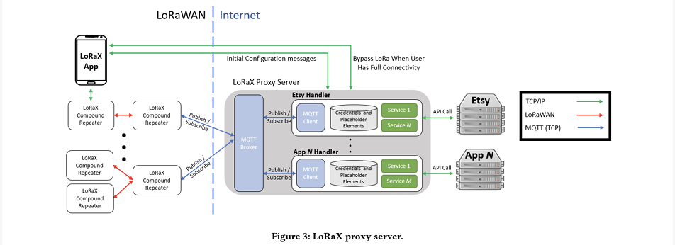

---

##### Download

+ [Paper](VHE+2022.pdf)

---

##### Abstract

Globally, 43% of households lack Internet access, primarily in regions where deployment and/or service costs are prohibitive, including in the least developed countries, rural locations, and regions with high concentrations of ethnic minorities and low-income populations. Unfortunately, this lack of Internet access increasingly equates to a lack of access to essential services, such as healthcare, education, and economic opportunities. In an environment of marginal economics, creative and varied approaches to obtaining access have flourished, including Internet kiosks long popular in the Global South, libraries as public access in the Global North, parking lot use of open WiFi access points, and spectrum-based solutions such as TV whitespace links and citizen band radio. In the near future, local 5G and the deployment of satellite constellations promise yet additional options in the price/performance space for access. In this context we are interested in the following research question: How can the presence of multiple networks, with different price, performance, and geographic reach profiles, be best used in concert to improve access to critical services? We propose that a robust answer to this question bears a holistic, cross-layer examination of new communication paradigms, network architecture innovation, and application design. We make this concrete by running to ground a specific case study of two networks, one high performance yet limited in geographic scope and the other low performance yet pervasive. Specifically our LoRaX (LoRa eXtends the Internet) system combines high bandwidth but non-pervasive Internet access with a low data rate, low power, yet ubiquitious network made possible by IoT developments. By focusing on two networks with extreme differences, we explore a design space that offers users new opportunities for participating in Internet-based services–even when high speed Internet connectivity is intermittent. We also reflect on the generality of the environment and our solution approach for future multi-network settings.

---

#### Figure 3. LoRaX proxy server.



---

##### Citation

Morgan Vigil-Hayes, Md Nazmul Hossain, Alexander K Elliott, Elizabeth M. Belding, and Ellen Zegura. 2022. LoRaX: Repurposing LoRa as a Low Data Rate Messaging System to Extend Internet Boundaries. In Proceedings of the 5th ACM SIGCAS/SIGCHI Conference on Computing and Sustainable Societies (COMPASS '22). Association for Computing Machinery, New York, NY, USA, 195–213. https://doi.org/10.1145/3530190.3534807

```BibTeX
@inproceedings{10.1145/3530190.3534807,
author = {Vigil-Hayes, Morgan and Hossain, Md Nazmul and Elliott, Alexander K and Belding, Elizabeth M. and Zegura, Ellen},
title = {LoRaX: Repurposing LoRa as a Low Data Rate Messaging System to Extend Internet Boundaries},
year = {2022},
isbn = {9781450393478},
publisher = {Association for Computing Machinery},
address = {New York, NY, USA},
url = {https://doi.org/10.1145/3530190.3534807},
doi = {10.1145/3530190.3534807},
abstract = {Globally, 43\% of households lack Internet access, primarily in regions where deployment and/or service costs are prohibitive, including in the least developed countries, rural locations, and regions with high concentrations of ethnic minorities and low-income populations. Unfortunately, this lack of Internet access increasingly equates to a lack of access to essential services, such as healthcare, education, and economic opportunities. In an environment of marginal economics, creative and varied approaches to obtaining access have flourished, including Internet kiosks long popular in the Global South, libraries as public access in the Global North, parking lot use of open WiFi access points, and spectrum-based solutions such as TV whitespace links and citizen band radio. In the near future, local 5G and the deployment of satellite constellations promise yet additional options in the price/performance space for access. In this context we are interested in the following research question: How can the presence of multiple networks, with different price, performance, and geographic reach profiles, be best used in concert to improve access to critical services? We propose that a robust answer to this question bears a holistic, cross-layer examination of new communication paradigms, network architecture innovation, and application design. We make this concrete by running to ground a specific case study of two networks, one high performance yet limited in geographic scope and the other low performance yet pervasive. Specifically our LoRaX (LoRa eXtends the Internet) system combines high bandwidth but non-pervasive Internet access with a low data rate, low power, yet ubiquitious network made possible by IoT developments. By focusing on two networks with extreme differences, we explore a design space that offers users new opportunities for participating in Internet-based services–even when high speed Internet connectivity is intermittent. We also reflect on the generality of the environment and our solution approach for future multi-network settings.},
booktitle = {Proceedings of the 5th ACM SIGCAS/SIGCHI Conference on Computing and Sustainable Societies},
pages = {195–213},
numpages = {19},
keywords = {challenged networking environment, digital divide, last mile connectivity, LPWAN, low data rate messaging, LoRa},
location = {Seattle, WA, USA},
series = {COMPASS '22}
}
```

