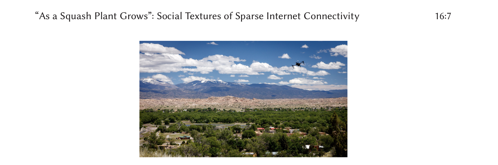

---

##### Download

+ [Paper](DVZ+2021.pdf)

---

##### Abstract

Researching and designing Internet infrastructure solutions in rural and tribal contexts requires reciprocal relationships between researchers and community partners. Methodologies must be meaningful amid local social textures of life. Achieving transdisciplinarity while relating research impacts to partner communities takes care work, particularly where technical capacity is scarce. The Full Circle Framework is an action research full stack development methodology that foregrounds reciprocity among researchers, communities, and sovereign Native nations as the axis for research purpose and progress. Applying the framework to deploy television white space infrastructure in sovereign Native nations in northern New Mexico reveals challenges for rural computing, including the need to design projects according to the pace of rural and tribal government workflows, cultivate care as a resource for overworked researchers and community partners, and co-create a demand for accurate government data around Internet infrastructures in Indian Country and through rural counties.

---

#### Figure 1. View of the landscape from a water tower at Santa Clara Pueblo in May 2019. The drone in the photo was used for network data collection.



---

##### Citation

Marisa Elena Duarte, Morgan Vigil-Hayes, Ellen Zegura, Elizabeth Belding, Ivone Masara, and Jennifer Case Nevarez. 2021. As a Squash Plant Grows: Social Textures of Sparse Internet Connectivity in Rural and Tribal Communities. ACM Trans. Comput.-Hum. Interact. 28, 3, Article 16 (June 2021), 16 pages. https://doi.org/10.1145/3453862

```BibTeX
@article{10.1145/3453862,
author = {Duarte, Marisa Elena and Vigil-Hayes, Morgan and Zegura, Ellen and Belding, Elizabeth and Masara, Ivone and Nevarez, Jennifer Case},
title = {As a Squash Plant Grows: Social Textures of Sparse Internet Connectivity in Rural and Tribal Communities},
year = {2021},
issue_date = {June 2021},
publisher = {Association for Computing Machinery},
address = {New York, NY, USA},
volume = {28},
number = {3},
issn = {1073-0516},
url = {https://doi.org/10.1145/3453862},
doi = {10.1145/3453862},
abstract = {Researching and designing Internet infrastructure solutions in rural and tribal contexts requires reciprocal relationships between researchers and community partners. Methodologies must be meaningful amid local social textures of life. Achieving transdisciplinarity while relating research impacts to partner communities takes care work, particularly where technical capacity is scarce. The Full Circle Framework is an action research full stack development methodology that foregrounds reciprocity among researchers, communities, and sovereign Native nations as the axis for research purpose and progress. Applying the framework to deploy television white space infrastructure in sovereign Native nations in northern New Mexico reveals challenges for rural computing, including the need to design projects according to the pace of rural and tribal government workflows, cultivate care as a resource for overworked researchers and community partners, and co-create a demand for accurate government data around Internet infrastructures in Indian Country and through rural counties.},
journal = {ACM Trans. Comput.-Hum. Interact.},
month = {jul},
articleno = {16},
numpages = {16},
keywords = {rural computing, community-based participatory research, Native American, spectrum}
}
```

