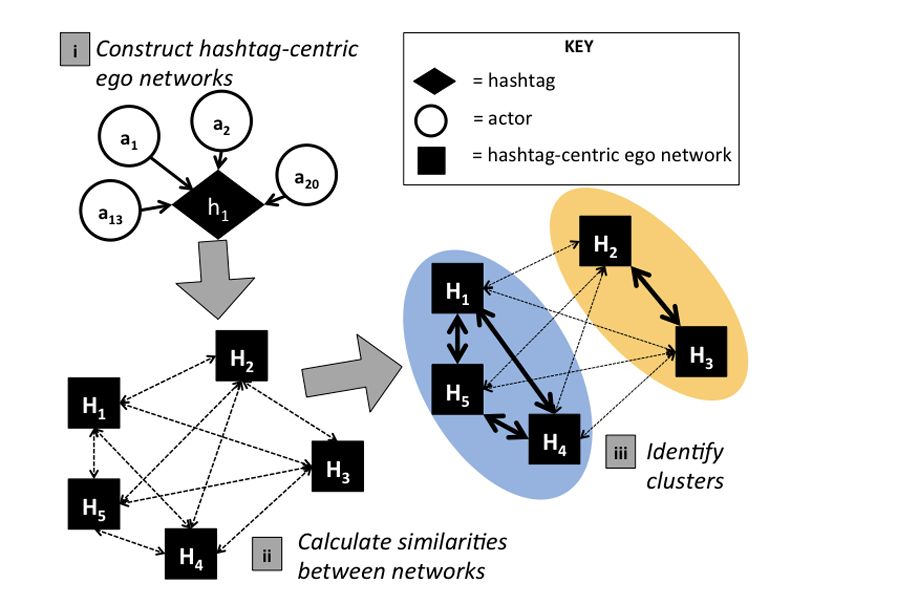

---

##### Download

+ [Paper](VDP+2017.pdf)

---

##### Abstract

With fewer than 66% of eligible voters registered and voter turnout rates 5-14 percentage points lower than any other ethnic group, Native Americans comprise the least participatory ethnic group in U.S. political elections [42, 57, 49, 25]. While discourse surrounding Native American issues and interests has increasingly moved to social media [55, 56], there is a lack of data about Native American political discourse on these platforms. Given the heterogeneity of Native American peoples in the U.S., one way to begin approaching a holistic understanding of Native American political discourse on social media is to characterize how Native American advocates utilize social media platforms for connective action. Using a post-structural, interdisciplinary, mixed methods approach, we use theories of connective action [5] and media richness [14] to analyze a Twitter data set culled from influential Native American advocates and their followers during the 2016 primary presidential election season. Our study sheds light on how Native American advocates use social media to propagate political information and identifies which issues are central to the political discourse of Native American advocates. Furthermore, we demonstrate how the bandwidth characteristics of content impact its propagation and we discuss this in the context of pernicious digital divide effects present in Indian Country.

---

#### Figure 1. Network analysis methodologies used to identify sub-communities in the Native American advocates data set. 



---

##### Citation

Morgan Vigil-Hayes, Marisa Duarte, Nicholet Deschine Parkhurst, and Elizabeth Belding. 2017. #Indigenous: Tracking the Connective Actions of Native American Advocates on Twitter. In Proceedings of the 2017 ACM Conference on Computer Supported Cooperative Work and Social Computing (CSCW '17). Association for Computing Machinery, New York, NY, USA, 1387–1399. https://doi.org/10.1145/2998181.2998194

```BibTeX
@inproceedings{10.1145/2998181.2998194,
author = {Vigil-Hayes, Morgan and Duarte, Marisa and Parkhurst, Nicholet Deschine and Belding, Elizabeth},
title = {#Indigenous: Tracking the Connective Actions of Native American Advocates on Twitter},
year = {2017},
isbn = {9781450343350},
publisher = {Association for Computing Machinery},
address = {New York, NY, USA},
url = {https://doi.org/10.1145/2998181.2998194},
doi = {10.1145/2998181.2998194},
abstract = {With fewer than 66\% of eligible voters registered and voter turnout rates 5-14 percentage points lower than any other ethnic group, Native Americans comprise the least participatory ethnic group in U.S. political elections [42, 57, 49, 25]. While discourse surrounding Native American issues and interests has increasingly moved to social media [55, 56], there is a lack of data about Native American political discourse on these platforms. Given the heterogeneity of Native American peoples in the U.S., one way to begin approaching a holistic understanding of Native American political discourse on social media is to characterize how Native American advocates utilize social media platforms for connective action. Using a post-structural, interdisciplinary, mixed methods approach, we use theories of connective action [5] and media richness [14] to analyze a Twitter data set culled from influential Native American advocates and their followers during the 2016 primary presidential election season. Our study sheds light on how Native American advocates use social media to propagate political information and identifies which issues are central to the political discourse of Native American advocates. Furthermore, we demonstrate how the bandwidth characteristics of content impact its propagation and we discuss this in the context of pernicious digital divide effects present in Indian Country.},
booktitle = {Proceedings of the 2017 ACM Conference on Computer Supported Cooperative Work and Social Computing},
pages = {1387–1399},
numpages = {13},
keywords = {social media, social network analysis, native american, civic engagement},
location = {Portland, Oregon, USA},
series = {CSCW '17}
}
```

